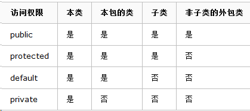

# JAVA面向对象基础

### 1.面向对象概念

面向过程(POP)与面向对象(OOP)

二者都是一种思想，面向对象是相对于面向过程而言的。面向过程，强调的是功能行为，以函数为最小单位，考虑怎么做。面向对象，将功能封装进对象，强调具备了功能的对象，以类/对象为最小单位，考虑谁来做。

面向对象更加强调运用人类在日常的思维逻辑中采用的思想方法与原则，如抽象、分类、继承、聚合、多态等

### 2.类与对象

类是对一类事物的描述，是抽象的、概念上的定义（包括属性，方法）

对象是实际存在的该类事物的每个个体，因而也称为实例，“万事万物皆对象”。

**创建对象：**对象是根据类创建的。在Java中，使用关键字new来创建一个新的对象。创建对象需要以下三步：

 **声明**：声明一个对象，包括对象名称和对象类型。

 **实例化**：使用关键字new来创建一个对象。

 **初始化**：使用new创建对象时，会调用构造方法初始化对象。

### 3.访问控制

指的是本类及本类内部的成员（成员变量、成员方法、内部类）对其他类的可见性，即这些内容是否允许其他类访问。

Java 中一共有四种访问权限控制，其权限控制的大小情况是这样的：public > protected > default(包访问权限) > private ,具体的权限控制看下面表格，列所指定的类是否有权限允许访问行的权限控制下的内容：

### 4.对象的生命周期

当一个对象被创建时，会对其中各种类型的成员变量自动进行初始化赋值。除了基本数据类型之外的都是变量类型都是引用类型

**匿名对象**

我们也可以不定义对象的句柄，而直接调用这个对象的方法。这样的对象叫做匿名对象， 如：new Person().shout();

如果对一个对象只需要进行一次方法调用，那么就可以使用匿名对象。

**我们经常将匿名对象作为实参传递给一个函数调用**。

### 5.static关键字

static可以用来修饰类的成员方法、类的成员变量，另外可以编写static代码块来优化程序性能。

#### static方法

static方法一般称作静态方法，由于静态方法不依赖于任何对象就可以进行访问，因此对于静态方法来说，是没有this的，因为它不依附于任何对象，既然都没有对象，就谈不上this了。并且由于这个特性，在静态方法中不能访问类的非静态成员变量和非静态成员方法，因为非静态成员方法/变量都是必须依赖具体的对象才能够被调用。

在静态方法中不能访问非静态成员方法和非静态成员变量，但是在非静态成员方法中是可以访问静态成员方法/变量的。

#### static变量

static变量也称作静态变量，静态变量和非静态变量的区别是：静态变量被所有的对象所共享，在内存中只有一个副本，它当且仅当在类初次加载时会被初始化。而非静态变量是对象所拥有的，在创建对象的时候被初始化，存在多个副本，各个对象拥有的副本互不影响。static成员变量的初始化顺序按照定义的顺序进行初始化。

#### static代码块

　static关键字还有一个比较关键的作用就是 用来形成静态代码块以优化程序性能。static块可以置于类中的任何地方，类中可以有多个static块。在类初次被加载的时候，会按照static块的顺序来执行每个static块，并且只会执行一次。

